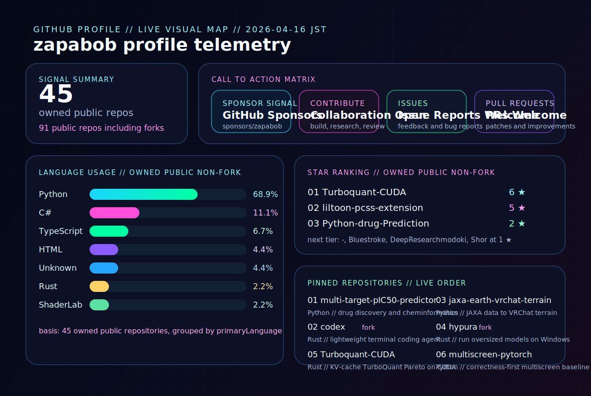

  

## Neon Control Panel

  
  
  
  

  AI systems, bioinformatics, medicinal chemistry, Unity, VRChat, autonomous agents, and experimental tooling.

  Based in Nagano, building research-driven software with a cyberpunk control-room aesthetic.

  

## Pinned Repositories

| Repo | Focus |
| --- | --- |
| [multi-target-pIC50-predictor](https://github.com/zapabob/multi-target-pIC50-predictor) | Multi-target pIC50 prediction, cheminformatics, and drug-discovery workflows |
| [codex](https://github.com/zapabob/codex) | Rust-based terminal coding agent fork in the current pinned set |
| [jaxa-earth-vrchat-terrain](https://github.com/zapabob/jaxa-earth-vrchat-terrain) | JAXA earth observation data transformed into VRChat terrain pipelines |
| [hypura](https://github.com/zapabob/hypura) | Rust fork focused on running oversized models on Windows hardware |
| [Turboquant-CUDA](https://github.com/zapabob/Turboquant-CUDA) | CUDA and Rust measurements for KV-cache TurboQuant Pareto experiments |
| [multiscreen-pytorch](https://github.com/zapabob/multiscreen-pytorch) | Correctness-first multiscreen PyTorch baseline and VRAM reduction research |

## Connect To The Grid

- [Sponsor @zapabob](https://github.com/sponsors/zapabob)
- [Browse repositories](https://github.com/zapabob?tab=repositories)
- [Report issues across active repos](https://github.com/issues?q=is%3Aopen+user%3Azapabob+archived%3Afalse)
- [Review or send pull requests](https://github.com/pulls?q=is%3Aopen+user%3Azapabob+archived%3Afalse+is%3Apr)
- [Follow on X](https://x.com/zapabob_ouj)

## Telemetry Notes

- Dashboard snapshot date: `2026-04-16` Asia/Tokyo
- Language mix uses owned public non-fork repositories
- Star ranking is shown separately from pinned repositories
- Pinned repositories follow the live GitHub pinned order
