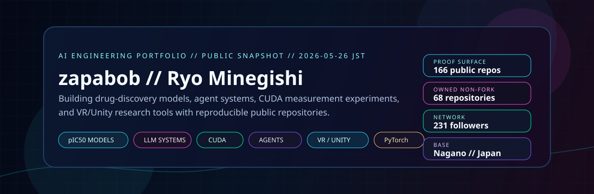
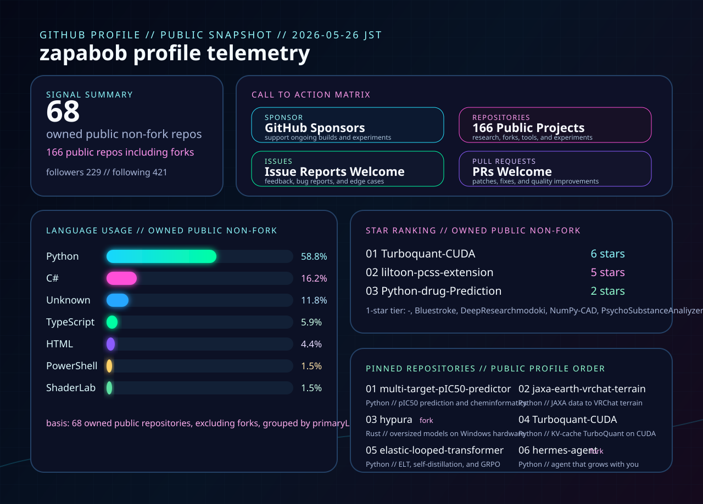

  

<h1 align="center">AI Engineering Portfolio // zapabob</h1>

  AI engineer building drug-discovery models, agent systems, CUDA measurement experiments, and VR/Unity research tools.

  
  
  
  

## Selected AI Engineering Results

| Problem | AI engineering work | Evidence | Repo |
| --- | --- | --- | --- |
| Drug-discovery signal modeling | Multi-target pIC50 platform for psychoactive and drug-like compounds using Transformer regression, RDKit descriptors, SMARTS scaffolds, and Optuna | DAT, 5HT2A, CB1, CB2, and opioid receptor workflows with GUI/CLI and session recovery | [multi-target-pIC50-predictor](https://github.com/zapabob/multi-target-pIC50-predictor) |
| GPU/LLM systems measurement | KV-cache TurboQuant Pareto experiments for Qwen3.5-9B on CUDA with captured replay | Measurement-focused repository for reproducible LLM systems experiments | [Turboquant-CUDA](https://github.com/zapabob/Turboquant-CUDA) |
| Experimental model research | Elastic Looped Transformer causal-LM port with Intra-Loop Self-Distillation and GRPO | PyTorch research implementation for advanced architecture experiments | [elastic-looped-transformer](https://github.com/zapabob/elastic-looped-transformer) |

  

## Portfolio Repositories

| Repo | Why it matters |
| --- | --- |
| [multi-target-pIC50-predictor](https://github.com/zapabob/multi-target-pIC50-predictor) | AI drug-discovery workflow: descriptors, Transformer regression, target-specific pIC50 prediction, GUI/CLI |
| [Turboquant-CUDA](https://github.com/zapabob/Turboquant-CUDA) | CUDA and LLM systems measurements for KV-cache TurboQuant Pareto analysis |
| [elastic-looped-transformer](https://github.com/zapabob/elastic-looped-transformer) | Experimental PyTorch model research: ELT, self-distillation, GRPO |
| [jaxa-earth-vrchat-terrain](https://github.com/zapabob/jaxa-earth-vrchat-terrain) | Data pipeline from JAXA earth-observation inputs to Blender, Unity, and VRChat terrain |
| [hermes-agent](https://github.com/zapabob/hermes-agent) | Agent tooling and local AI assistant experimentation |
| [liltoon-pcss-extension](https://github.com/zapabob/liltoon-pcss-extension) | Unity/VRChat C# extension work for production-style shader tooling |

## Engineering Focus

- AI for drug discovery: pIC50 prediction, cheminformatics, RDKit-style descriptors, receptor-target workflows
- LLM systems: CUDA measurement, KV-cache experimentation, model-efficiency tradeoff analysis
- Agentic software: autonomous assistant tooling, workflow automation, local-first research systems
- Research implementation: PyTorch experiments, architecture ports, reproducible exploratory code
- Spatial computing: Unity, Blender, VRChat, terrain pipelines, and creator tooling

## Connect

- [Browse repositories](https://github.com/zapabob?tab=repositories)
- [Sponsor @zapabob](https://github.com/sponsors/zapabob)
- [Report issues across active repos](https://github.com/issues?q=is%3Aopen+user%3Azapabob+archived%3Afalse)
- [Review or send pull requests](https://github.com/pulls?q=is%3Aopen+user%3Azapabob+archived%3Afalse+is%3Apr)
- [Follow on X](https://x.com/zapabob_ouj)

## Snapshot Notes

- Profile snapshot date: `2026-05-26` Asia/Tokyo
- Public profile counts and repository telemetry were refreshed from GitHub REST API and the public profile page
- Current public surface: `166` public repositories, `68` owned public non-fork repositories, `231` followers
- Current public pinned order: `multi-target-pIC50-predictor`, `jaxa-earth-vrchat-terrain`, `hypura`, `Turboquant-CUDA`, `elastic-looped-transformer`, `hermes-agent`
